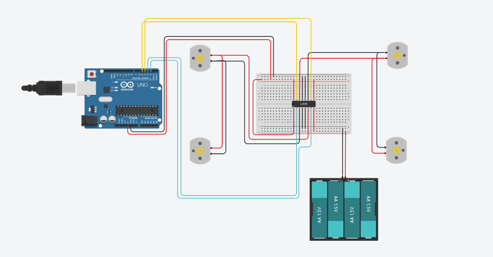
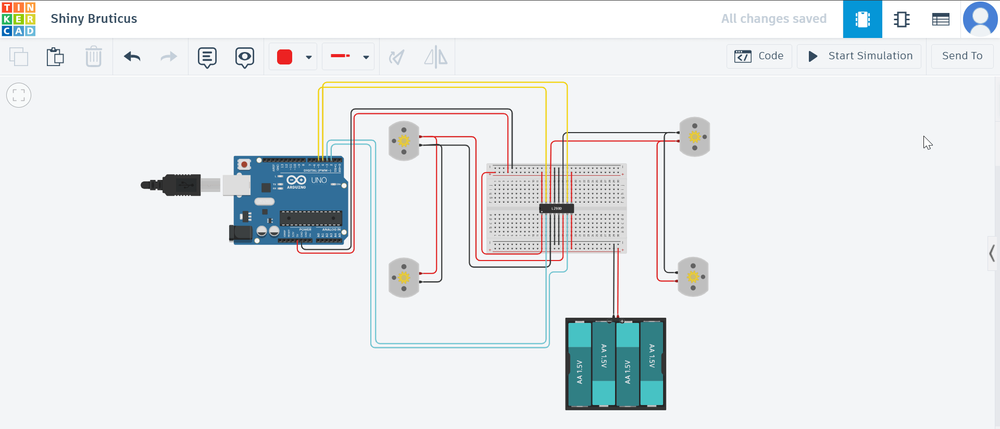

# DC and Servo Motor with Distance Sensing

##  Project Idea
This project simulates a **car-like robot** using an **L293D motor driver shield** to control **4 DC motors** and perform a predefined sequence of movements:  
1. Move forward for **30 seconds**.  
2. Move backward for **1 minute**.  
3. Alternate turning right and left for **1 minute**.  

In the second phase, a **servo motor** and an **ultrasonic sensor (HC-SR04)** are added.  
If the sensor detects an obstacle within **10 cm**, the motors stop immediately, and the robot changes its movement direction.

##  Components
This project was simulated using **Tinkercad** with the following components:  
- Arduino UNO  
- L293D Motor Driver Shield  
- 4 × DC Motors  
- Servo Motor  
- Ultrasonic Sensor (HC-SR04)  
- Jumper Wires  
- External Power Supply  

##  Key Components Explained

### 1. DC Motor
A DC motor converts direct current into rotational motion, with speed controlled by voltage and direction changed by polarity.


### 2. L293D Motor Driver
The L293D is a motor driver IC (chip) that controls motor direction and speed.  
In Tinkercad, the standalone chip is available instead of the full motor driver shield.


### 3. Ultrasonic Sensor (HC-SR04)
An ultrasonic sensor measures distance by sending sound waves and timing their echo, commonly used for obstacle detection.


## Part One – Without Servo and Ultrasonic

### Wiring
In this stage, only the **L293D motor driver** and **DC motors** are connected to the Arduino UNO.  
The wiring is based on two motor groups: **Motor A** and **Motor B**, each controlling the wheels on one side of the robot.

> **Notes:**  
> - **Motor 1** and **Motor 2** are connected in **parallel** to work together as the right side.  
> - **Motor 3** and **Motor 4** are connected in **parallel** to work together as the left side.  

| Arduino Pin | L293D Pin | Function |
|-------------|-----------|----------|
| **2**       | IN1       | Motor A – Direction 1 |
| **3**       | IN2       | Motor A – Direction 2 |
| **4**       | IN3       | Motor B – Direction 1 |
| **5**       | IN4       | Motor B – Direction 2 |

 


---

###  Turning Logic in Code
In this project, the turning is done using a **pivot turn**, where one side moves while the other side stops.  
This is different from a **point turn**, where one side moves forward and the other side moves backward to rotate in place.

```cpp
void turnRight() {
  digitalWrite(ENA, HIGH);
  digitalWrite(IN1, HIGH); digitalWrite(IN2, LOW);  // Left side moves forward
  digitalWrite(IN3, LOW);  digitalWrite(IN4, LOW);  // Right side stops
}

void turnLeft() {
  digitalWrite(ENA, HIGH);
  digitalWrite(IN1, LOW);  digitalWrite(IN2, LOW);  // Left side stops
  digitalWrite(IN3, HIGH); digitalWrite(IN4, LOW);  // Right side moves forward
}
```

