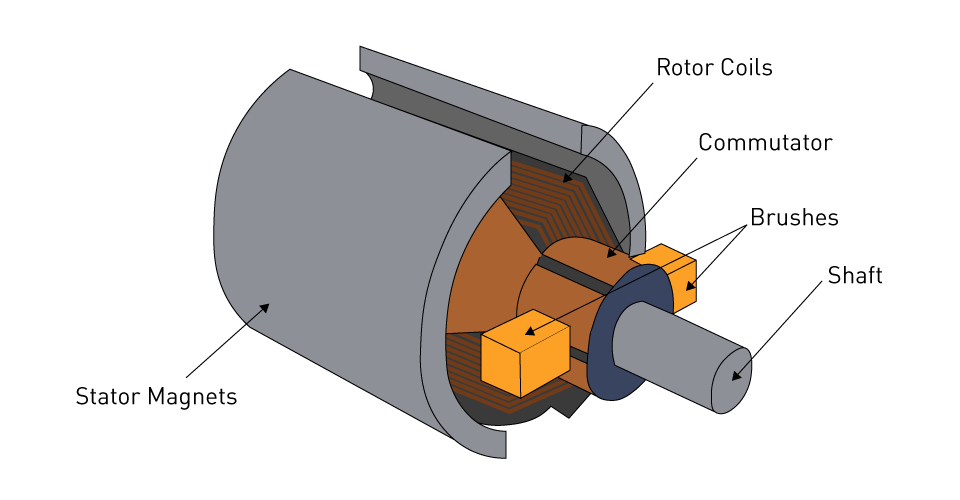
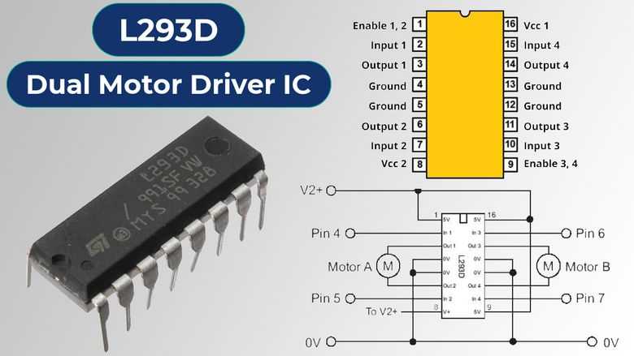
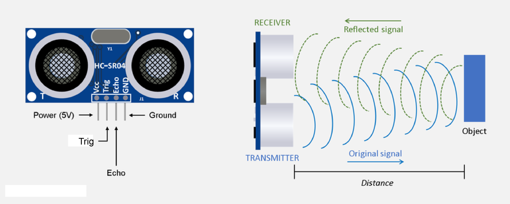

# DC and Servo Motor with Distance Sensing

##  Project Idea
This project simulates a **car-like robot** using an **L293D motor driver shield** to control **4 DC motors** and perform a predefined sequence of movements:  
1. Move forward for **30 seconds**.  
2. Move backward for **1 minute**.  
3. Alternate turning right and left for **1 minute**.  

In the second phase, a **servo motor** and an **ultrasonic sensor (HC-SR04)** are added.  
If the sensor detects an obstacle within **10 cm**, the motors stop immediately, and the robot changes its movement direction.

##  Components
This project was simulated using **Tinkercad** with the following components:  
- Arduino UNO  
- L293D Motor Driver Shield  
- 4 × DC Motors  
- Servo Motor  
- Ultrasonic Sensor (HC-SR04)  
- Jumper Wires  
- External Power Supply  

##  Key Components Explained

### 1. DC Motor
A DC motor converts direct current into rotational motion, with speed controlled by voltage and direction changed by polarity.

### 2. L293D Motor Driver
The L293D is a motor driver IC (chip) that controls motor direction and speed.  
In Tinkercad, the standalone chip is available instead of the full motor driver shield.

### 3. Ultrasonic Sensor (HC-SR04)
An ultrasonic sensor measures distance by sending sound waves and timing their echo, commonly used for obstacle detection.

